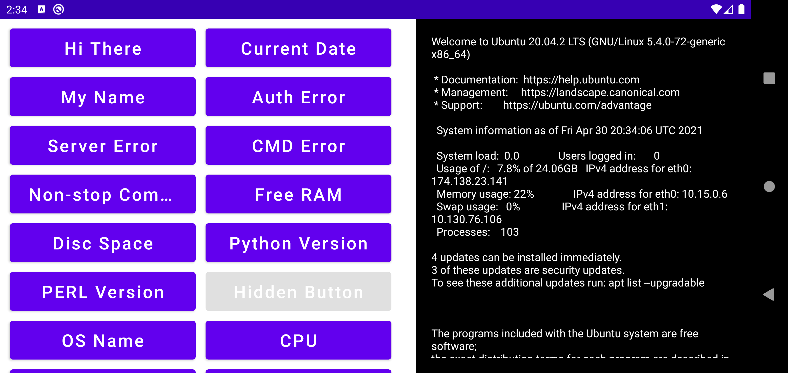

Oceanize Android test
============================================================================

Code for Oceanize Android coding test

Introduction
------------

This is an app where you can executes command on SSH server end by clicking command buttons. The app displays them in a list.
You can see the output of those command via a black screen.



This codelab has four branches, representing different code states:

* [Dependency Injection](https://github.com/arsojib/Oceanize_Android_Test/tree/master/app/src/main/java/com/mysoft/oceanizeandroidtest/di)
* [View and Business logics](https://github.com/arsojib/Oceanize_Android_Test/tree/master/app/src/main/java/com/mysoft/oceanizeandroidtest/view)

Pre-requisites
--------------

You should be familiar with:

* The Kotlin programming language, including [Kotlin coroutines](https://developer.android.com/kotlin/coroutines) and their interaction with [Android Jetpack components](https://developer.android.com/topic/libraries/architecture/coroutines).
* The following core Android Jetpack libraries: [ViewModel](https://developer.android.com/topic/libraries/architecture/viewmodel),
 [LiveData](https://developer.android.com/topic/libraries/architecture/livedata) and 
  [Data Binding](https://developer.android.com/topic/libraries/data-binding).
* Application architecture, following the pattern from the [Guide to app architecture](https://developer.android.com/jetpack/docs/guide) and [Android Fundamentals codelabs](https://developer.android.com/courses/kotlin-android-fundamentals/toc).


Getting Started
---------------
1. Download the project.
2. Update Android studio and other sdk file to latest version if needed
3. Check out one of the codelabs mentioned above.

Features
---------------
1. Execute command on SSH server
2. See output or error if occurs

Usage
---------------
**Required Permissions**

```xml
<uses-permission android:name="android.permission.INTERNET" />
```

**Initialize the** ```SSH Client```

```Java
val client: SshClient = SshClient.setUpDefaultClient()
        client.forwardingFilter = AcceptAllForwardingFilter.INSTANCE
        client.start()
```

**Establishing connection for executing command**
```Java
client.connect(commandInfo.username, commandInfo.host, commandInfo.port)
                        .verify(10000)
                        .session
                        .use { session: ClientSession ->
                            session.addPasswordIdentity(commandInfo.password)
                            session.auth().verify(50000)
                            println("Connection establihed")

                            // Create a channel to communicate
                            val channel = session.createChannel(Channel.CHANNEL_SHELL)
                            println("Starting shell")
                            val responseStream = ByteArrayOutputStream()
                            channel.setOut(responseStream)

                            // Open channel
                            channel.open().verify(5, TimeUnit.SECONDS)
                            channel.invertedIn.use { pipedIn: OutputStream ->
                                pipedIn.write("commandInfo.command".toByteArray())
                                pipedIn.flush()
                            }

                            // Close channel
                            channel.waitFor(
                                EnumSet.of(ClientChannelEvent.CLOSED),
                                TimeUnit.SECONDS.toMillis(5)
                            )

                            // Output after converting to string type
                            val responseString = String(responseStream.toByteArray())
                            println(responseString)
                            commandOutput.postValue(responseString)
                        }
```


License
-------

Free App, Cheers!!!
